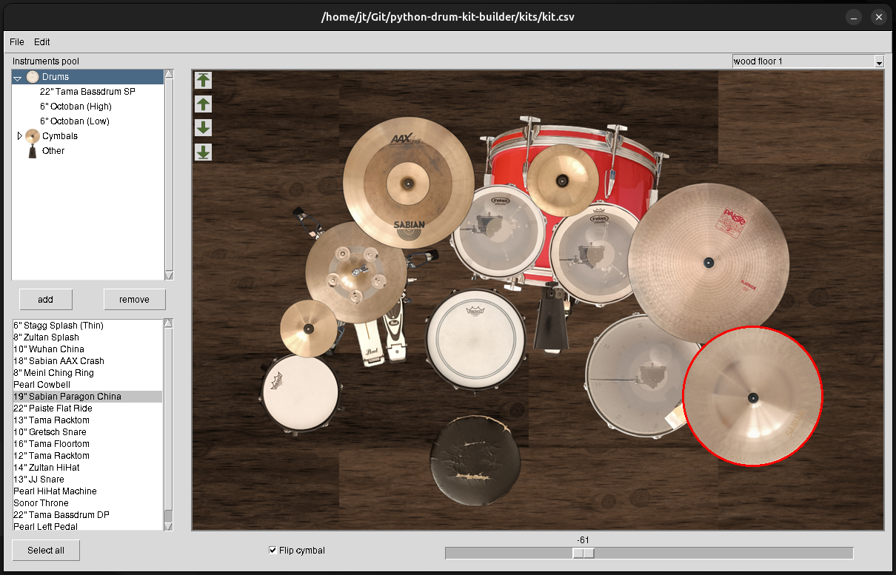

# python-drum-kit-builder
Software development of a virtual drum kit building tool in python. 

## Motivation
Several virtual drum kit building applications can be found on the internet. They are fun to use, but mostly lack options for personalization. This project offers an alternative that can be used locally and allows the user to customize the gear available in the editor (for example with photos of owned instruments). Designed kits can be saved, edited and exported as an image. The planning of gigs, sessions etc. with custom instruments is effortless and fun.

## Project Structure
- `resources/`: image files and gear.csv
- `kits/`: saved example kits and images
- `utils/`: utility modules
- `models/`: instrument and canvas element modules
- core script **main.py** and additional files in root folder

The code mostly follows a MVC (Model View Controller) structure to simplify future maintaining.

## Tools
- Python
- Python native packages
- tkinter, customtkinter
- PIL

## How to Run
The scripts were tested on Linux (Ubuntu) and Win10/11.
Some Python packages (and Python itself) need to be installed to run the code.

Linux Dependencies:

This project uses tkinter for the GUI.
On Linux, tkinter may not be installed by default.
Install it using your system package manager as shown further below.

Then install Python dependencies:
`pip install -r requirements.txt`

Run the core script:
`python3 main.py`

On Ubuntu you can alternatively simply run the test_install.sh file (might take a minute to run):
`bash test_install.sh`

### Tkinter on Ubuntu / Debian
`sudo apt install python3-tk`

### Tkinter on Fedora (not tested)
`sudo dnf install python3-tkinter`

### Tkinter on Arch (not tested)
`sudo pacman -S tk`

## Key Features
With this editor you can design virtual drum kits using custom images of your owned (or other) gear. You can:
- change any items layer
- rotate items and flip cymbals
- save and load kits to files
- save created kits as image
- move around items with the mouse or arrow keys
- adjust key movement step size (under "Edit")

## Notes
- If you want to be able to run the editor on a system without Python or all of the necessary packages, you can create a standalone version with cx_Freeze, or generate a standalone version with your preferred method.
- Instructions on how to customize instruments will be provided in the future. Users with some knowledge of Python
may be able to follow helpful comments in the scripts.

## Future Improvements
- Simplify parts of the code
- Improve user friendliness (In-editor instrument management, flexible window size and shape, guided notebook for adding instruments)
- Improve optics
- Add features (instructions, sample sounds)
- Create standalone
